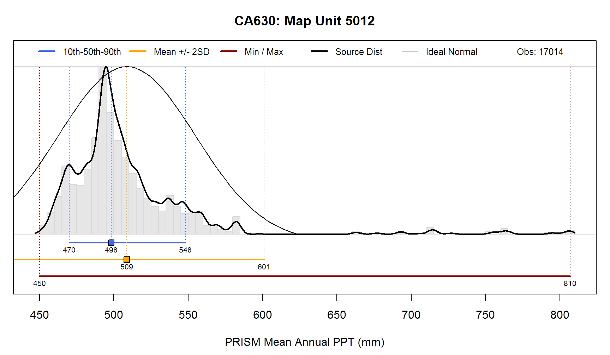

# Discussion and proposal on the topic of "range in characteristics" and the related "low-RV-high" definition

* To provide edits or comments on this document, contact dylan.beaudette@ca.usda.gov or jennifer.wood@ca.usda.gov

A concise rationale for a clearly defined set of "ranges" was given by Wilding et al. in 1964. In the following decades, various authors addressed the issue of ranges for soil and map unit properties, offering both philosophical and operational approaches (Jansen and Arnold 1976, Hudson 1980 and 1990, Young et al 1991). Until the creation of the NASIS SSURGO database, soil and map unit property data were  provided to users, in the printed manuscripts, as ranges with two end points. These ranges were developed using the "Form 5" from pedon data collected during initial soil survey operations. When NASIS was created, the concept of the "representative value (RV)" was added to the range end points ("low" and "high") in order to provide a single value needed by a variety of modern uses made possible by the digital environment. When the manuscript range values were converted from the intermediate 3SD database to NASIS, the middle value between the two end points was used to populate the RV. For subsequent initial soil surveys, the low, RV, and high values were populated directly into NASIS, using a variety of approaches.

The kinds of variables for which we provide numerical ranges in the NASIS database are as follows:
Soil properties/derived values for component horizons in a map unit:	clay %, pH, Ksat, bulk density, %OM, EC, 
Soil properties and environmental data for components in a map unit:	surface fragments, diagnostic feature depths, Slope, MAAT, MAST

Population of "low", "RV", and "high" values in the NASIS Component table is major part of initial mapping and update work. The definitions of "low", "RV", and "high" values are not defined in the National Soil Survey Handbook and other National and Regional guidance is variable or lacking. As a result, the population of these values varies across Regions, office areas, survey areas and even across map units within a survey area. A common approach for the RV is to use the values from the "modal" or Component pedon designated as the representative pedon for that component in the NASIS Data Mapunit.

Discussions among some Soil Science Division staff have centered around the desire to have a quantitative definition for the "low, RV, and high" values, to better accomodate computationally derived values, when available, for populating the SSURGO database. There is currently this proposed edit to the National Soil Survey Handbook Part 618.55 for the population of Component Slope Gradient in NASIS:

"These values may be determined by a statistical summary of the slope gradient layer for a given map unit layer. Slope gradient distributions are seldom normal, eliminating the use of conventional statistical parameters like mean and standard deviation as tools for determining the high, low a representative values. These values should be based on the robust parameters of percentiles. The representative value is based on the median. The low and high should be based on ranges that capture a majority of the area represented in a map unit. Using the 10th and 90th percentiles as the low and high, represents 80 percent of the area."

We propose here to decide on a standard towards which we aspire for all values in NASIS. There appears to be general agreement on the central tendency approach, with RV as median/50th percentile.  For the low/high we can settle on a set of values, acknowledging any limitations. There is a lack of consensus on which percentiles to target for the low and the high. The 5th and 95th, 10th and 90th,  and 25th and 75th  have been suggested. [See the references folder for extended email exchange on this topic](https://github.com/ncss-tech/soil-range-in-characteristics/tree/master/references), in the document titled "RV definition email discussion". 

In the proposal described here, we suggest that the "low" is intended to approximate the 5th to 10th percentile, and the high is intended to approximate the 90th to the 95th percentile. This acknowledges that the data developer has leeway in populating this value depending on the quantity of data, the quality of the data, and the kind of variable being described.  For instance, the data source may be for the map unit, whereas the value being reported is for the map unit component.  Or, data being summarized may be for component soil properties, where much less data might exist, and a wider range of the samples would like to be included ( for instance 5th to 95th percentiles, encompassing 90% of the range observed). This would be in contrast perhaps to modeled raster-based elevation or climatic data sets, where a narrow range of samples could be included due to the abundance of pixel values available to sample (10th to 90th percentiles, where capturing 80% of the range might be more appropriate).

The following proposal attempts to formulate a quantitative definition for the terms "low, RV, high", while accomodating the legacy data for which no definition was established. 

# Proposal for changes to the National Soil Survey Handbook - new definitions of â--low-representative value-high"

## Authors/supporters 
(Add your name if you concur with this proposal, include title and email address.)

 * Jennifer Wood, Soil Data Quality Specialist, Region 2 Soil Survey Office, jennifer.wood@ca.usda.gov
 * Dylan Beaudette, Digital Soil Mapping Specialist, Region 2 Soil Survey Office, dylan.beaudett@ca.usda.gov
 * Tom D'Avello, Soil Scientist/GIS Specialist, NSSC-Geospatial Research Unit, tom.davello@wv.usda.gov
 * Stephen Roecker -- Soil Data Quality Specialist/GIS Specialist, NRCS Region 11, stephen.roecerk@in.usda.gov
 * Russ Almaraz, GIS Specialist, Region 2 Soil survey office, russ.almaraz@ca.usda.gov
 * Jason Nemecek, State Soil Scientist, Wisconsin, jason.nemecek@wi.usda.gov
 * Skye Wills, Soil Scientist, National Soil Survey Center, skye.wills@ca.usda.gov

## Justification

Currently the terms low, rv, and-high are mentioned in sections [618.2 and 618.3 of the NSSH](https://www.nrcs.usda.gov/wps/portal/nrcs/detail/soils/ref/?cid=nrcs142p2_054223), but not defined. A loose definition has
made sense because of the highly variable
methods used to populate the low, rv, and high values in all of the various
data fields in NASIS that represent a collection of many different vintages and
sources of soil survey data. And, for much of the uses of soil survey
information, this level of precision likely provides enough accuracy. Additionally,
this new more precise definition likely reflects how past data developers
have thought about the meaning of low-rv-high.
We have always tended to populate the rv as a median or a mode, rather
than a mean - a commonly occuring value, near the center of the distribution of all observed values. We have always thought
about the low and high as values within the observed data set that approximated
not the extreme, but commonly observed, ends of the data distribution. 

For recent, ongoing, and future data collection efforts however, we aspire to populate
NASIS fields using as much field-collected data as possible. As our data
becomes more and more widely used, it has become increasingly urgent that we
establish more precise definitions for these data ranges. While acknowledging
that older data may not have been populated using this particular guidance,
updated definitions are needed for current work that can accommodate more
data-driven and modern approaches to computing soil survey data ranges. Clear definitions
will more completely convey our best available knowledge to users and provide a
standard to assure the correct uses and limitations of our data.

## Proposed definition for new section C. in Part 618.2

For recent and newly populated information in NASIS, the representative values are meant to approximate the 50th percentile (median) . The 50th percentile is the value where 50% of the data are both above and below that value. The low and high values are meant to approximate the 5th- 10th and the 90th-95th percentiles, respectively. For example, the 5th percentile is the value where 5% of the data are below that value and the 95th percentile is the value where 5% of the data are above that value. The low, high, and representative values for data populated prior to this version of the National Soil Survey Handbook were not guided by the percentile approach but generally approximate the current definition. Even where data used to populate the SSURGO database are not computationally derived, the populated values are designed to approximate the aforementioned percentiles for the data set being described.

The percentile approach is preferable to other measures of central tendency, such as the mean and standard deviation, because percentiles require no distributional assumptions and the percentile values fall within the bounds of the data set from which they are computed. This means that percentiles can provide benchmarks for the spread and central tendency for both normal and non-normal distributions, and the values will always fall within the minimum and maximum of the observed data. Consider a hypothetical data set for field-described clay content from the A horizon of the same taxa:

  * clay content: 11, 10, 12, 23, 17, 16, 17, 14, 24, 22, 14
  * clay content sorted: 10, 11, 12, 14, 14, 16, 17, 17, 22, 23, 24
  * Low/10th percentile	=	11
  * RV/50th percentile	=	16
  * High/90th percentile	=	23

## Discussion

### Why Percentiles?

* Percentiles require no distributional assumptions and are bound to the data from which they are computed. This means that percentiles can provide meaningful benchmarks for both normal and non-normal distributions, and, the limits will always fall within the min/max of the observed data.

* Percentiles have a direct interpretation: "given the available data, we know that soil property X is <= Y 5% of the time, and, <= Z 95% of the time". This same statement can be framed using probabilities or proportions: "given the available data, soil property X is within the range of Y--Z 90% of the time".

* Percentiles are simple to calculate, requiring at least 3, but ideally 10 observations.

[Visit this link for more discussion and graphical demonstrations of these concepts.](https://ncss-tech.github.io/soil-range-in-characteristics/why-percentiles.html) 

### Concerns

* Many folks aren't familiar with percentiles: establishing a definition for low,rv,high based on percentiles will require some education.

* There is concern about how a new standard will cast doubt on previously established data. How do we inform the user of
different approaches to data population based on vintage of guidance?

* There is concern that dictating Low, RV, High definitions and putting an emphasis on computing values takes away from our ability to interject our "expert knowledge". The use of the word "approximate" is meant to accommodate the incorporation of the field knowledge of soil properties and map unit concepts in the determination of exact values for Data Mapunit population in NASIS.

* There is no consensus on the specific percentiles to pin our low and high concepts to: some argue for 5th/95th, others for 10th/90th, and some others for floating percentiles for different soil properties.

* Computed Low-RV-High values ultimately depend on consistent and meaningful correlation of data.

* Can a computed RV supplant a modal pedon value? Consider Berman Hudson's (Hudson, 1990) proposition that mean values are adequate 
predictors of soil behavior and that we need not be overly concerned with modal values of individual taxa found in a map unit.

# Resources

 * [Harrell-Davis quantile estimator](https://garstats.wordpress.com/2016/06/09/the-harrell-davis-quantile-estimator/) -- [link to original article](https://www.jstor.org/stable/2335999?seq=1#page_scan_tab_contents)
 
 * Comparison of groups via [shift function](https://garstats.wordpress.com/2016/07/12/shift-function/), [illustrated version](https://garstats.wordpress.com/2017/02/04/shift-function-illustration/)
 

# References

See [reference folder of this GitHub page](https://github.com/ncss-tech/soil-range-in-characteristics/tree/master/references) to access most of these papers

https://casoilresource.lawr.ucdavis.edu/wiki/Low-rv-high

Hudson, B.D. 1980. Ranges in characteristics-how valid are they? Soil Survey Horizons. 21:7-11.

Hudson, B.D. 1990. Concepts of soil mapping and interpretation. Soil Survey Horizons. 31:36-72.

Hyndman, R. J. and Fan, Y. 1996. Sample Quantiles in Statistical Packages. The American Statistician. 50: 361-365.

Indorante, S.J. 2007. Foundational Soil Survey Data-A Case for Linking Basic Soil Data and Interpretations to the Official Series Description. Soil Survey Horizons. 48:43-45.

Jansen, I. and Arnold, R. 1976. Defining Ranges of Soil Characteristics, in "Spatial Variabilities of Soils and Landforms". SSSA Spec. Publ. 28. Soil Science Society of America, pp. 89-92.

Livingston, R. L. 2006. "Truthiness" and the National Soil Information System: How Are They Related? Soil Survey Horizons. 47:43-46.

Scovlin, J. 2011. Digitnal Soil Mapping: Quantifying the Soil-Landscape Paradigm. NCSS Newsletter Issue 55.

Wilding, L., Scafer, G., Jones, R. 1964. Morley and Blount soils: A statistical summary of certain physical and chemical properties of some selected profiles from Ohio. Soil Sci. Soc. Proc. 28:674-679.

Young, F., Maatta, J., Hammer, R. 1991. Confidence Intervals for Soil Properties within Map Units in "Spatial Variabilities of Soils and Landforms". SSSA Spec. Publ. 28. Soil Science Society of America, pp. 213-230.

